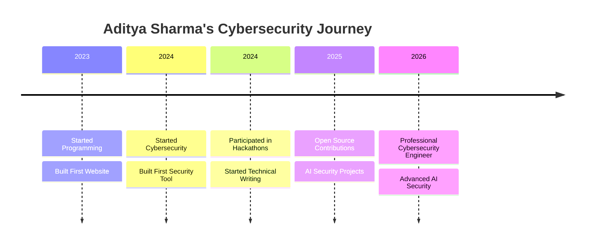

<div align="center">

<!-- Profile Image with Border -->


<br/>

<!-- Name -->
<h1 style="color: #00d4ff; text-shadow: 0 0 20px rgba(0, 212, 255, 0.5);">Aditya Sharma</h1>

<!-- Subtitle -->


<br/>

<!-- Badges -->
<a href="https://adii-sharma.vercel.app/">
  
</a>
<a href="https://www.linkedin.com/in/aditya-sharma90/">
  
</a>
<a href="https://medium.com/@aditya_sharma_09">
  
</a>
<a href="https://tryhackme.com/p/Aditya.Sharma.08">
  
</a>
<a href="mailto:adityaiit687@gmail.com">
  
</a>

<br/>

<!-- Profile Views -->


</div>

---

## About Me

```yaml
name: "Aditya Sharma"
username: "aditya226-sharma"
title: "Cybersecurity Engineer | AI Security Researcher | Full Stack Developer"
education: "B.Tech in Computer Science Engineering (Cyber Security)"
location: "India"
languages: ["Python", "JavaScript", "TypeScript", "Java", "C", "C++", "Bash"]
interests:
  - Cybersecurity
  - Artificial Intelligence
  - Full Stack Development
  - Cloud Security
  - Open Source
current_focus: "Building AI-powered security solutions"
philosophy: "Learning by building real-world projects"
```

I'm a passionate **Cybersecurity Engineering** student who believes in learning by building. I specialize in creating **AI-powered security solutions**, **full-stack applications**, and **open-source tools**. When I'm not writing code, you'll find me publishing technical articles on [Medium](https://medium.com/@aditya_sharma_09), competing in hackathons, or exploring new vulnerabilities on [TryHackMe](https://tryhackme.com/p/Aditya.Sharma.08).

---

## Career Interests

| Security | Development | Research |
|:---:|:---:|:---:|
|  |  |  |
|  |  |  |
|  |  |  |
|  |  |  |
|  |  |  |
|  |  |  |

---

## Current Mission


---

## Tech Stack

### Languages


### Frontend


### Backend & Databases


### Cloud & DevOps


### Cybersecurity


---

## GitHub Statistics

<a href="https://github.com/aditya226-sharma">
  
  
</a>

<br/>

<a href="https://github.com/aditya226-sharma">
  
</a>

<br/>


---

## Featured Projects

<table>
<tr>
<td width="50%">

### AI Malware Detection


AI-powered malware detection system using machine learning algorithms to identify and classify malicious files in real-time.

[](https://github.com/aditya226-sharma)
[](https://adii-sharma.vercel.app/)

</td>
<td width="50%">

### Cyber AI Platform


Full-stack cybersecurity platform integrating AI for threat detection, vulnerability scanning, and security monitoring.

[](https://github.com/aditya226-sharma)
[](https://adii-sharma.vercel.app/)

</td>
</tr>
<tr>
<td width="50%">

### AI Security Assistant


Intelligent security assistant powered by AI to help developers identify vulnerabilities and implement secure coding practices.

[](https://github.com/aditya226-sharma)
[](https://adii-sharma.vercel.app/)

</td>
<td width="50%">

### Threat Intelligence Dashboard


Real-time threat intelligence dashboard with data visualization, IOC tracking, and automated alerting systems.

[](https://github.com/aditya226-sharma)
[](https://adii-sharma.vercel.app/)

</td>
</tr>
<tr>
<td width="50%">

### Security Automation Toolkit


Collection of automated security tools for vulnerability scanning, penetration testing, and security auditing.

[](https://github.com/aditya226-sharma)

</td>
<td width="50%">

### Personal Portfolio


Modern, responsive portfolio website showcasing projects, skills, and achievements with premium UI/UX design.

[](https://github.com/aditya226-sharma)
[](https://adii-sharma.vercel.app/)

</td>
</tr>
</table>

---

## Social Links

<a href="https://github.com/aditya226-sharma">
  
</a>
<a href="https://www.linkedin.com/in/aditya-sharma90/">
  
</a>
<a href="https://medium.com/@aditya_sharma_09">
  
</a>
<a href="https://adii-sharma.vercel.app/">
  
</a>
<a href="https://tryhackme.com/p/Aditya.Sharma.08">
  
</a>
<a href="mailto:adityaiit687@gmail.com">
  
</a>

---

## Certifications


---

## Achievements


---

## Cybersecurity Journey



---

## Snake Animation


---

## Visitor Counter


---

<div align="center">

**Thanks for visiting my profile!**


</div>
