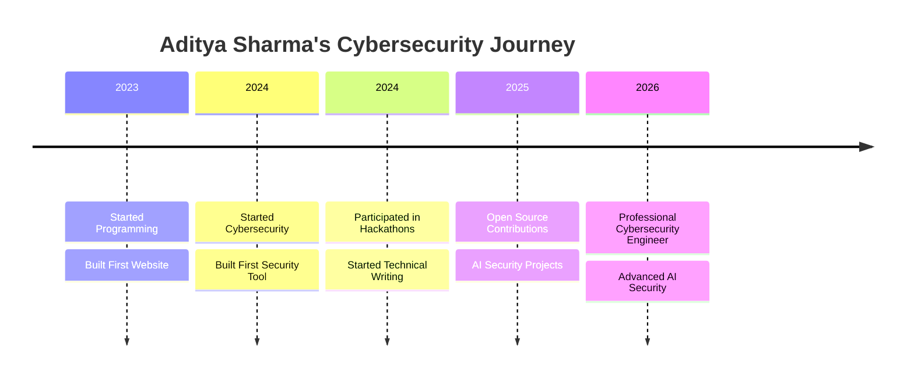

<div align="center">

<!-- Profile Image with Border -->


<br/>

<!-- Name -->
<h1 style="color: #00d4ff; text-shadow: 0 0 20px rgba(0, 212, 255, 0.5);">Aditya Sharma</h1>

<!-- Subtitle -->


<br/>

<!-- Badges -->
<a href="https://adii-sharma.vercel.app/">
  
</a>
<a href="https://www.linkedin.com/in/aditya-sharma90/">
  
</a>
<a href="https://medium.com/@aditya_sharma_09">
  
</a>
<a href="https://tryhackme.com/p/Aditya.Sharma.08">
  
</a>
<a href="mailto:adityaiit687@gmail.com">
  
</a>

<br/>

<!-- Profile Views -->


</div>

---

## About Me

```yaml
name: "Aditya Sharma"
username: "aditya226-sharma"
title: "Cybersecurity Engineer | AI Security Researcher | Full Stack Developer"
education: "B.Tech in Computer Science Engineering (Cyber Security)"
location: "India"
languages: ["Python", "JavaScript", "TypeScript", "Java", "C", "C++", "Bash"]
interests:
  - Cybersecurity
  - Artificial Intelligence
  - Full Stack Development
  - Cloud Security
  - Open Source
current_focus: "Building AI-powered security solutions"
philosophy: "Learning by building real-world projects"
```

I'm a passionate **Cybersecurity Engineering** student who believes in learning by building. I specialize in creating **AI-powered security solutions**, **full-stack applications**, and **open-source tools**. When I'm not writing code, you'll find me publishing technical articles on [Medium](https://medium.com/@aditya_sharma_09), competing in hackathons, or exploring new vulnerabilities on [TryHackMe](https://tryhackme.com/p/Aditya.Sharma.08).

---

## Career Interests

| Security | Development | Research |
|:---:|:---:|:---:|
|  |  |  |
|  |  |  |
|  |  |  |
|  |  |  |
|  |  |  |
|  |  |  |

---

## Current Mission


---

## Tech Stack

### Languages


### Frontend


### Backend & Databases


### Cloud & DevOps


### Cybersecurity


---

## 📊 GitHub Statistics

<div align="center">


</div>

<br>

<table>
<tr>
<td align="center" width="50%">

### 🔥 GitHub Stats


</td>
<td align="center" width="50%">

### 🏆 Top Languages


</td>
</tr>
</table>

<br>

<div align="center">

### 📈 Contribution Activity


</div>

<br>

<div align="center">

### 🔥 Streak Stats


</div>

---

## Featured Projects

<table>
<tr>
<td width="50%">

### CYBERVERSE


The world's first interactive 3D cyber defense simulation — an immersive cybersecurity training environment built with Three.js.

[](https://github.com/aditya226-sharma/CYBERVERSE)
[](https://adii-sharma.vercel.app/)

</td>
<td width="50%">

### Security Arsenal


A comprehensive cybersecurity toolkit for security professionals — includes scanners, exploit utilities, and forensic analysis tools.

[](https://github.com/aditya226-sharma/security-arsenal)

</td>
</tr>
<tr>
<td width="50%">

### NetSentinel


Network traffic analysis and security monitoring framework — captures, analyzes, and alerts on suspicious network activity in real-time.

[](https://github.com/aditya226-sharma/netsentinel)
[](https://adii-sharma.vercel.app/)

</td>
<td width="50%">

### Zero Trust Lab


Zero Trust security architecture implementation with micro-segmentation, continuous verification, and least-privilege access controls.

[](https://github.com/aditya226-sharma/zero-trust-lab)

</td>
</tr>
<tr>
<td width="50%">

### PhishGuard


AI-powered phishing detection system that analyzes URLs, email headers, and page content to identify and block phishing attempts.

[](https://github.com/aditya226-sharma/PhishGuard)

</td>
<td width="50%">

### Personal Portfolio


Modern, responsive portfolio website showcasing projects, skills, and achievements with premium UI/UX design.

[](https://github.com/aditya226-sharma/adii-sharma)
[](https://adii-sharma.vercel.app/)

</td>
</tr>
</table>

---

## Social Links

<a href="https://github.com/aditya226-sharma">
  
</a>
<a href="https://www.linkedin.com/in/aditya-sharma90/">
  
</a>
<a href="https://medium.com/@aditya_sharma_09">
  
</a>
<a href="https://adii-sharma.vercel.app/">
  
</a>
<a href="https://tryhackme.com/p/Aditya.Sharma.08">
  
</a>
<a href="mailto:adityaiit687@gmail.com">
  
</a>

---

## 🏆 Certifications & Professional Credentials

> *A curated collection of my professional certifications, credentials, and achievements in cybersecurity, cloud, and technology.*

---

### 🛡️ Cybersecurity Certifications

<table>
<tr>
<td width="50%">

**Certified Online Fraud Prevention Specialist (COFPS)**


| | |
|---|---|
| **Issuing Organization** | Hack & Fix Academy |
| **Category** | Cybersecurity |
| **Credential ID** | `COFPS-XXXX-XXXX` |
| **Issue Date** | 2025 |
| **Skills** | Fraud Prevention, Online Security |

[](https://hackandfix.com)

</td>
<td width="50%">

**Cybersecurity Career Starter Certificate (CCSC)**


| | |
|---|---|
| **Issuing Organization** | Hack & Fix Academy |
| **Category** | Cybersecurity |
| **Credential ID** | `CCSC-XXXX-XXXX` |
| **Issue Date** | 2025 |
| **Skills** | Cybersecurity Fundamentals, Career Prep |

[](https://hackandfix.com)

</td>
</tr>
<tr>
<td width="50%">

**Introduction to Critical Infrastructure Protection (ICIP)**


| | |
|---|---|
| **Issuing Organization** | OPSWAT Academy |
| **Category** | Critical Infrastructure |
| **Credential ID** | `ICIP-XXXX-XXXX` |
| **Issue Date** | 2025 |
| **Skills** | Critical Infrastructure Security, OPSWAT |

[](https://opswat.com)

</td>
<td width="50%">

**Drop Certified Security Course (DCSC) – Web Application Penetration Testing**


| | |
|---|---|
| **Issuing Organization** | The Drop Organization |
| **Category** | Penetration Testing |
| **Credential ID** | `DCSC-XXXX-XXXX` |
| **Issue Date** | 2025 |
| **Skills** | Web App Pentesting, Vulnerability Assessment |

[](https://thedrop.org)

</td>
</tr>
</table>

---

### ☁️ Cloud & Architecture

<table>
<tr>
<td width="50%">

**AWS Solutions Architecture Job Simulation**


| | |
|---|---|
| **Issuing Organization** | Forage |
| **Category** | Cloud Architecture |
| **Credential ID** | `FORAGE-AWS-XXXX` |
| **Issue Date** | 2025 |
| **Skills** | AWS, Cloud Architecture, Solutions Design |

[](https://www.theforage.com)

</td>
</tr>
</table>

---

### 🏢 Industry Job Simulations

<table>
<tr>
<td width="50%">

**Deloitte Australia – Cyber Job Simulation**


| | |
|---|---|
| **Issuing Organization** | Forage |
| **Category** | Industry Simulation |
| **Credential ID** | `FORAGE-DELOITTE-XXXX` |
| **Issue Date** | 2025 |
| **Skills** | Cyber Security Analysis, Real-world Scenarios |

[](https://www.theforage.com)

</td>
<td width="50%">

**Tata – Cybersecurity Analyst Job Simulation**


| | |
|---|---|
| **Issuing Organization** | Forage |
| **Category** | Industry Simulation |
| **Credential ID** | `FORAGE-TATA-XXXX` |
| **Issue Date** | 2025 |
| **Skills** | Security Analysis, Threat Detection |

[](https://www.theforage.com)

</td>
</tr>
</table>

---

### 💼 Professional Experience

<table>
<tr>
<td width="50%">

**Cyber Security Internship**


| | |
|---|---|
| **Organization** | Redynox |
| **Role** | Intern |
| **Category** | Professional Experience |
| **Duration** | 2025 |
| **Skills** | Cyber Security, Practical Experience |

</td>
<td width="50%">

**Cyber Security Mentorship Program**


| | |
|---|---|
| **Organization** | LaunchED Global |
| **Role** | Mentee |
| **Category** | Mentorship |
| **Duration** | 2025 |
| **Skills** | Cybersecurity, Career Development |

</td>
</tr>
</table>

---

### 🚀 Open Source & Community

<table>
<tr>
<td width="50%">

**GirlScript Summer of Code (GSSoC) 2026**


| | |
|---|---|
| **Organization** | GirlScript Foundation |
| **Role** | Selected Contributor |
| **Category** | Open Source |
| **Tracks** | Open Source Track, AI Agents Track |
| **Year** | 2026 |

[](https://gssoc.girlscript.tech)
[](https://gssoc.girlscript.tech)

</td>
<td width="50%">

**NVIDIA Developer Program**


| | |
|---|---|
| **Organization** | NVIDIA Developer Program |
| **Role** | Member |
| **Category** | Developer Community |
| **Benefits** | Early Access, SDKs, Resources |
| **Year** | 2025 |

[](https://developer.nvidia.com)

</td>
</tr>
<tr>
<td width="50%">

**AINCAT 2026**


| | |
|---|---|
| **Category** | AI Competition |
| **Role** | Participant |
| **Year** | 2026 |

</td>
<td width="50%">

**Cryptonic Area – Cyber Security & Ethical Hacking Virtual Internship**


| | |
|---|---|
| **Organization** | Cryptonic Area |
| **Status** | Selected |
| **Category** | Virtual Internship |
| **Skills** | Ethical Hacking, Cyber Security |

</td>
</tr>
</table>

---

### 📊 Achievement Summary

<table>
<tr>
<td align="center" width="14%">


**Total**
**Credentials**

</td>
<td align="center" width="14%">


**Cybersecurity**
**Certifications**

</td>
<td align="center" width="14%">


**Cloud**
**Certifications**

</td>
<td align="center" width="14%">


**Industry Job**
**Simulations**

</td>
<td align="center" width="14%">


**Internships**
**Completed**

</td>
<td align="center" width="14%">


**Open Source**
**Programs**

</td>
<td align="center" width="14%">


**Community**
**Programs**

</td>
</tr>
</table>

---

### 📌 Future Certification Roadmap

> *My roadmap to becoming a world-class cybersecurity professional*

<table>
<tr>
<td width="33%">

#### 🎯 Entry Level


</td>
<td width="33%">

#### 🎯 Intermediate Level


</td>
<td width="33%">

#### 🎯 Advanced Level


</td>
</tr>
<tr>
<td width="33%">

#### 🎯 Cloud Security


</td>
<td width="33%">

#### 🎯 Microsoft Certifications


</td>
<td width="33%">

#### 🎯 Specialized Certifications


</td>
</tr>
<tr>
<td colspan="3" align="center">

#### 🎯 Ultimate Goals


</td>
</tr>
</table>

---

## Cybersecurity Journey



---

## Visitor Counter


---

<div align="center">

**Thanks for visiting my profile!**

</div>

---

## Dev Log

<details open>
<summary><b>July 2026</b></summary>

<br>

- **July 27** — Deployed 22+ repos to Vercel (Next.js, Vite, static HTML) across multiple projects. Fixed CI/CD, TypeScript errors, and Vercel config issues.
- **July 28** — Continued deployments, fixed remaining TypeScript errors, lockfile issues, and template cleanup across remaining repos.
- **July 30** — Updated GitHub profile README with refreshed content, fixed badge typos, added new featured projects (CYBERVERSE, security-arsenal), and replaced generic profile links with direct repo links.

</details>
