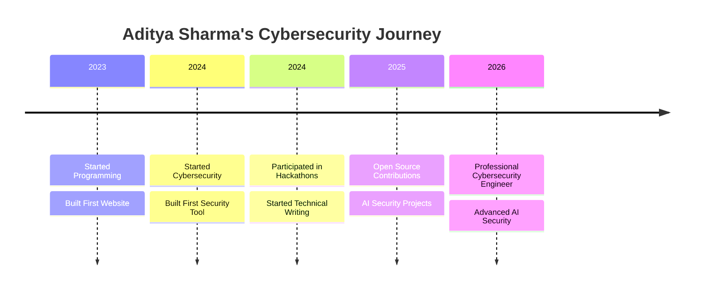

<!-- 3D Animated Background -->

<!-- Glowing Profile Frame -->

  

    
  

<!-- 3D Rotating Name -->

  ADITYA SHARMA

<!-- Glitch Effect Subtitle -->

  CYBERSECURITY ENGINEER

<!-- Typing Animation -->

  

<!-- 3D Floating Badges -->

  
  
  
  
  

<!-- Profile Views with Glow -->

  

---

<!-- 3D Stats Section -->

## **GitHub Statistics**

---

<!-- 3D Tech Stack Section -->

## **Tech Stack**

### Languages

### Frontend

### Backend & Databases

### Cloud & DevOps

### Cybersecurity

---

<!-- 3D Projects Section -->

## **Featured Projects**

<table>
<tr>
<td width="50%">

### AI Malware Detection

AI-powered malware detection system using machine learning algorithms to identify and classify malicious files in real-time.

</td>
<td width="50%">

### Cyber AI Platform

Full-stack cybersecurity platform integrating AI for threat detection, vulnerability scanning, and security monitoring.

</td>
</tr>
<tr>
<td width="50%">

### AI Security Assistant

Intelligent security assistant powered by AI to help developers identify vulnerabilities and implement secure coding practices.

</td>
<td width="50%">

### Threat Intelligence Dashboard

Real-time threat intelligence dashboard with data visualization, IOC tracking, and automated alerting systems.

</td>
</tr>
</table>

---

<!-- 3D Social Section -->

## **Connect With Me**

---

<!-- 3D Trophies Section -->

## **Achievements**

---

<!-- 3D Journey Timeline -->

## **Cybersecurity Journey**

---

<!-- Snake Animation -->

## **Contribution Activity**

---

<!-- 3D Visitor Counter -->

---

  Thanks for visiting my profile!

